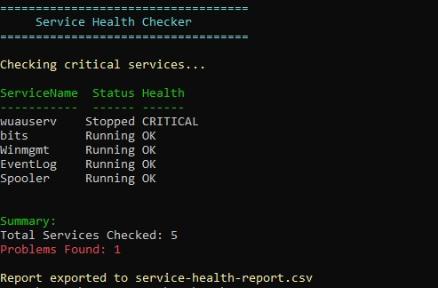

# Day 002 - Windows Service Health Checker

## Objective

Build a PowerShell script to monitor the status of critical Windows services then generate a health report.

## What It Does

* Checks key Windows services
* Identifies whether each service is running or stopped
* Flags critical issues
* Exports results to CSV for documentation

## Concepts Learned

* Get-Service cmdlet
* Arrays and loops
* Conditional logic (if/else)
* Error handling
* Creating custom PowerShell objects
* Exporting data to CSV

## Real-World Use Case

System Administrators and IT Support teams frequently monitor Windows services to ensure system stability and uptime. This script helps automate that process and quickly identify service failures.

## Services Monitored

* Windows Update (wuauserv)
* Background Intelligent Transfer Service (bits)
* Windows Management Instrumentation (Winmgmt)
* Windows Event Log (EventLog)
* Print Spooler (Spooler)

## Output

* Table view of service status
* Summary of issues found
* CSV export for reporting

## Reflection

This project introduces basic system monitoring and is a step toward building real-world IT automation tools used in production environments.
