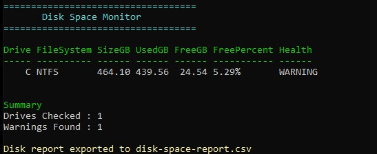

# Day 003 - Disk Space Monitor

## Objective

Build a PowerShell script that monitors local disk usage and identifies drives with low available storage.

## Features

* Retrieves all local drives
* Calculates total, used, and free disk space
* Calculates the percentage of free space
* Flags drives below a configurable warning threshold
* Displays a formatted report
* Exports results to a CSV file

## Concepts Learned

* Get-Volume
* Where-Object
* foreach loops
* PSCustomObject
* Calculated properties
* Conditional logic
* Export-Csv

## Real-World Use Case

Low disk space is a common cause of application failures, failed updates, and server issues. System Administrators often monitor storage utilization to proactively prevent outages.

This script automates the process of checking drive health and provides an easy-to-read report that can be used for routine maintenance or troubleshooting.

## Skills Gained

* Storage monitoring
* Data formatting
* Reporting with CSV
* Building reusable administrative scripts

## Reflection

Today I built a storage monitoring tool that checks disk utilization, identifies low-space drives, and exports the results for documentation. This is another practical script that demonstrates how PowerShell can simplify routine system administration tasks.