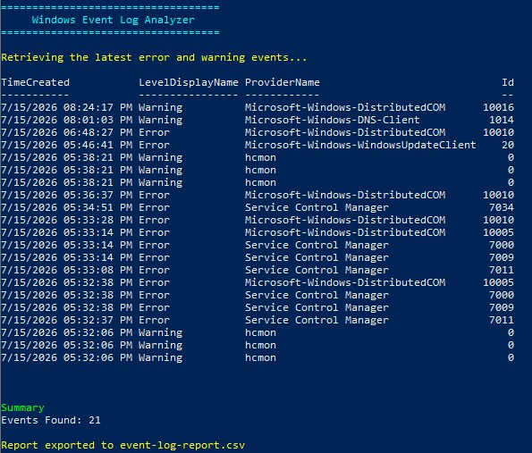

# Day 004 - Windows Event Log Analyzer

## Objective

Build a PowerShell script that retrieves recent warning and error events from the Windows System Event Log.

## Features

* Reads the Windows System Event Log
* Filters warning and error events
* Displays key event information
* Exports results to a CSV report

## Concepts Learned

* Get-WinEvent
* Filtering PowerShell objects
* Where-Object
* Select-Object
* Export-Csv
* Event log analysis

## Real-World Use Case

Windows Event Logs are one of the primary sources of information when diagnosing system issues.

IT Support Technicians and System Administrators regularly review these logs to investigate hardware failures, service crashes, driver problems, and operating system errors.



## Output

The script displays:

* Event Time
* Severity Level
* Event Source
* Event ID

It also exports the results to:

```text
event-log-report.csv
```

## Skills Gained

* Reading Windows Event Logs
* Filtering important events
* Creating troubleshooting reports
* Exporting structured data

## Reflection

Today I learned how to use PowerShell to analyze Windows Event Logs. This script provides a quick overview of recent warning and error events, making it a useful troubleshooting tool for IT Support and System Administration.
